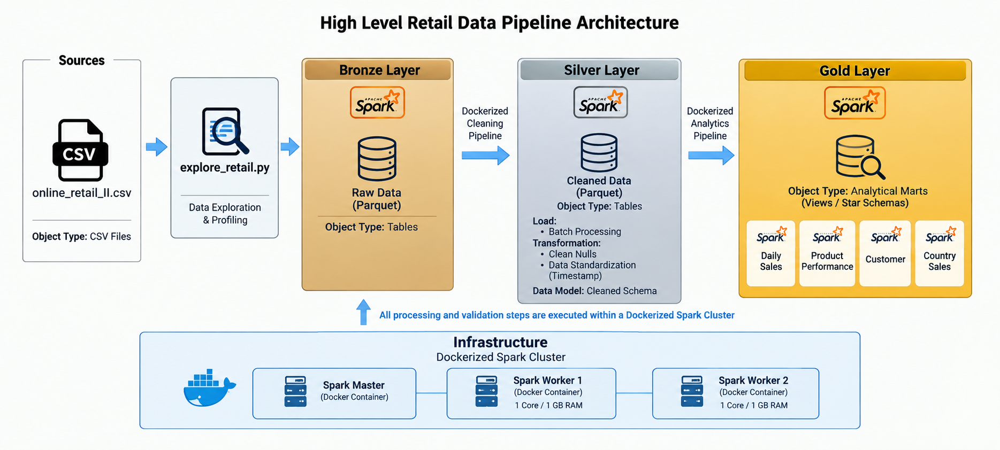
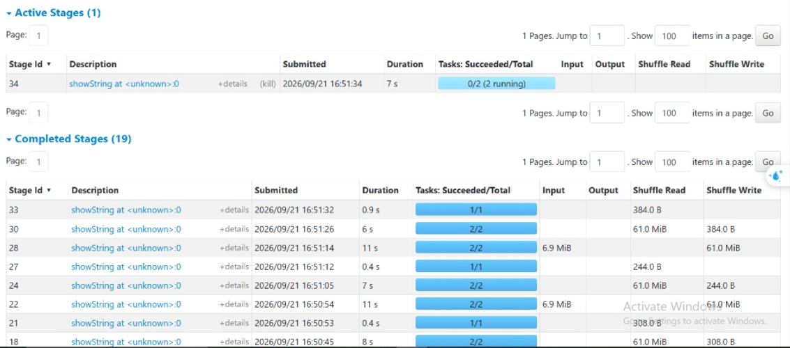

# Online Retail II — End-to-End Distributed Data Engineering Pipeline

An end-to-end Data Engineering project built with **Apache Spark / PySpark**, **Docker**, **Docker Compose**.

The project processes the **Online Retail II** transactional dataset through a distributed Spark cluster using a **Bronze → Silver → Gold** architecture, applies data-quality rules and business transformations, creates analytical data marts, and optimizes the output for BI consumption.

## Project Overview

The goal is to demonstrate how a retail dataset can be transformed from raw CSV data into business-ready analytical datasets using distributed Spark processing.

## Architecture


### Main objectives

- Build a local distributed Apache Spark cluster with Docker.
- Ingest raw retail data using an explicit Spark schema.
- Preserve the raw data in a Bronze layer.
- Clean and transform the data in a Silver layer.
- Build business-oriented Gold data marts.
- Validate data quality and business-metric reconciliation.
- Demonstrate Spark partitions, shuffles, narrow/wide transformations, joins, broadcast joins, and data skew.


## Technology Stack

| Technology | Purpose |
|---|---|
| Python | Pipeline development |
| PySpark | Distributed data processing |
| Apache Spark 3.5.6 | Distributed execution engine |
| Docker | Containerized Spark environment |
| Docker Compose | Spark cluster orchestration |
| Parquet | Columnar storage |
| Git / GitHub | Version control and portfolio |

## Dataset

The project uses the **Online Retail II** dataset. You can download the raw data from Kaggle here: 
[Online Retail II UCI Dataset](https://www.kaggle.com/datasets/mashlyn/online-retail-ii-uci)

**Note for Setup:** 
Download the dataset, extract the `.csv` file from the downloaded archive, and place it inside the `data/raw/` directory in this repository before running the pipeline infrastructure.

Note: The raw CSV files and generated Parquet outputs are intentionally excluded from version control via .gitignore to keep the repository lightweight and secure.

### Initial data-quality observations

- 4,382 missing descriptions.
- 243,007 missing customer IDs.
- 34,335 exact duplicate rows.
- 19,494 cancelled-invoice rows.
- 22,950 rows with negative quantity.
- 6,207 rows with non-positive prices.
- Quantity ranged from -80,995 to 80,995.

These issues are intentionally treated as part of the ETL/data-quality workflow rather than being blindly removed at ingestion.


## Data Pipeline Architecture (Medallion)

This project implements a Medallion Data Architecture to process, clean, and transform raw retail data into business-ready analytical data marts.

### Bronze Layer (Raw Data)

* **Purpose:** Ingests the raw source data (CSV) and saves it as Parquet files using an explicit schema.
* **Process:** Preserves the exact state of the source data without applying any business logic or data cleaning.
* **Validation:** Ensures a 100% row match between the source and the Bronze layer (1,067,371 rows).

### Silver Layer (Cleansed Data)

* **Purpose:** Acts as the data quality and transformation layer.
* **Process:** Removes exact duplicates, handles missing values, and calculates new derived business columns (e.g., `Revenue`, `TransactionType`, and `IsReturn`).
* **Business Logic:** Classifies transactions into Sales, Returns, or Cancellations based on invoice prefixes and quantity values.
* **Output:** A refined, clean dataset ready for analysis, containing 1,027,017 rows and 11 columns.

### Gold Layer (Analytical Marts)

* **Purpose:** Consumes the Silver data to build aggregated, business-oriented Data Marts optimized for BI dashboards (like Power BI).
* **Marts Created:**
1. **Daily Sales Mart:** Aggregated by `SaleDate + Country` to track daily trends.
2. **Product Performance Mart:** Aggregated by `StockCode` to analyze product rankings, units sold, and return rates.
3. **Customer Mart:** Aggregated by `Customer ID + Country` to evaluate customer value and Average Order Value (excludes null Customer IDs).
4. **Country Sales Mart:** Aggregated by `Country` for geographical market ranking.


### Final Gold Metrics

| Metric | Value |
|---|---:|
| Gross Sales | 20,476,260.45 |
| Return Amount | 0.00 |
| Cancelled Amount | 1,462,797.75 |
| Units Sold | 11,205,148 |
| Return Units | 0 |
| Net Revenue | 19,013,462.70 |

The Gold reconciliation matched the source metrics with no material difference.

# Data Quality & Validation

The project includes validation for:

- Bronze source-to-target row counts.
- Silver data-quality rules.
- Gold business-metric reconciliation.
- Null checks.
- Gold grain uniqueness.
- Product mart grain: `StockCode`.
- Customer mart grain: `Customer ID + Country`.
- Country mart grain: `Country`.
- Ranking validation.
- Negative net-revenue monitoring.

### Validation observations

```text
Product rows with negative NetRevenue : 30
Customer rows with negative NetRevenue: 81
Country rows with negative NetRevenue : 1
```

These are treated as business observations rather than automatically deleted records.

# Project Structure

```text
online-retail-spark/
│
├── data/
│   ├── raw/
│   │   └── online_retail_II.csv
│   ├── bronze/
│   ├── silver/
│   └── gold/
│
├── src/
│   ├── common/
│   │   ├── spark_session.py
│   │   └── run_pipeline.py
│   ├── exploration/
│   │   └── explore_retail.py
│   ├── bronze/
│   │   └── load_bronze.py
│   ├── silver/
│   │   └── transform_silver.py
│   └── gold/
│       ├── build_gold_marts.py
│       └── validate_gold.py
│
├── Diagrams-Spark-UI/
│       ├──Architecture_Diagram.png
│       ├── spark_stages_shuffle.png
│       ├── spark_jobs_execution.png
│       └── spark_cluster_overview.png
│
├── docker-compose.yml
├── requirements.txt
├── README.md
└── .gitignore
```

# Running the Project

## 1. Start the Spark cluster

```bash
docker compose up -d
```

## 2. Open Spark Master UI

```text
http://localhost:8080
```

Expected cluster configuration:

```text
2 Workers
2 Total Cores
```

Each worker:

```text
1 Core
1 GB RAM
```

## 3. Run the pipeline

```bash
docker exec -it spark-master bash
```

Then:

```bash
python /src/common/run_pipeline.py
```


# Key Engineering Concepts Demonstrated

- Distributed data processing
- Spark Cluster Architecture
- SparkSession
- Explicit schemas
- Lazy evaluation
- Actions vs transformations
- Narrow transformations
- Wide transformations
- Shuffle
- Jobs / Stages / Tasks
- Spark UI
- DataFrames
- GroupBy
- Joins
- Broadcast joins
- Data skew
- Repartition vs coalesce
- Parquet
- Partition pruning
- Predicate pushdown
- Column pruning
- Snappy compression
- Medallion architecture
- Data quality validation
- Business-metric reconciliation
- Data marts
- Pipeline orchestration
- Dockerized infrastructure

## Spark UI & Execution Details



# Author

**Assem Osama**

Computer Science & Artificial Intelligence Student  
Data Engineering Focus

GitHub: `https://github.com/Assem-osama`

LinkedIn: `https://linkedin.com/in/assem-osama-008a51268`
